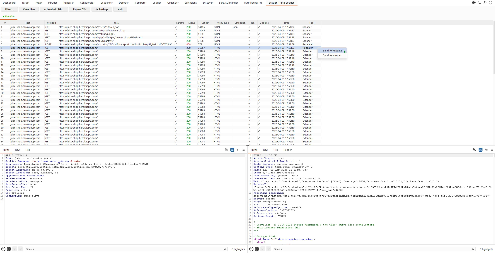
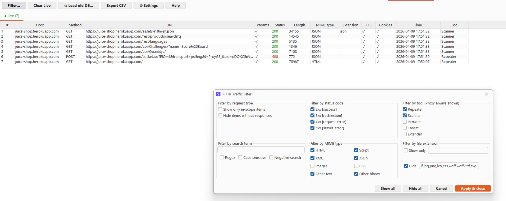
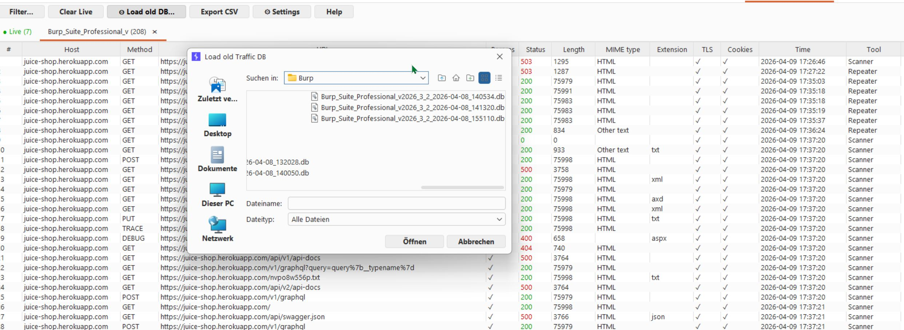
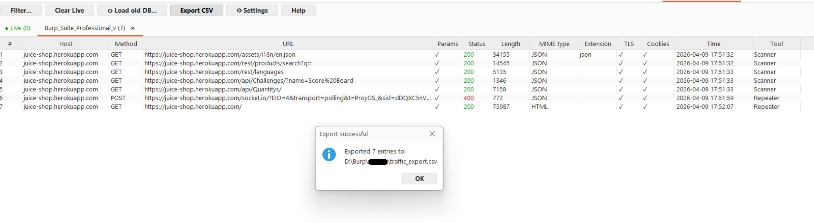

# Session Traffic Logger

A Burp Suite extension for persistent HTTP traffic logging and session analysis.

## Why?

Burp's built-in Proxy history only captures Proxy traffic.

Burp's Logger tool can capture traffic from multiple tools,
but it is **not persistent** – all logged data is lost when Burp is closed.
While Burp allows exporting logs as plain text, these cannot be reimported or analysed further within Burp.

During pentests, relevant requests often originate from Scanner, Intruder, or Repeater –
for example when identifying requests that triggered unexpected behavior or crashes.

Session Traffic Logger solves this by providing:
- Persistent cross-tool logging (Scanner, Repeater, Intruder, Target, Extender)
- Session replay – reload and analyse previous sessions at any time
- Unified traffic view across all Burp tools
- Advanced filtering and CSV export

---

## What is Session Traffic Logger?

Session Traffic Logger captures and persistently stores HTTP traffic from all Burp tools
(Repeater, Scanner, Intruder, etc.) into a local SQLite database.

Unlike Burp's built-in Proxy history, this extension:
- Logs traffic from **all tools**, not just Proxy
- **Persists data** across Burp restarts
- Allows you to **load and compare previous sessions**
- Provides **advanced filtering** similar to Burp's Proxy view

> ⚠️ Note: Proxy traffic is **NOT** logged by this extension.
> Use Burp's built-in Proxy tab to inspect Proxy traffic.

---

## Requirements

- Burp Suite Professional or Community Edition (2022.3+ recommended)
- Java 17 or newer (bundled with Burp Suite)
- No additional dependencies required

---

## Installation

### Step 1 – Download the JAR

Download `session-traffic-logger.jar` from the link provided by the developer.

### Step 2 – Load in Burp Suite

1. Open Burp Suite
2. Go to **Extensions → Extensions → Add**
3. Set **Extension type** to `Java`
4. Click **Select file** and choose `session-traffic-logger.jar`
5. Click **Next**

### Step 3 – First Run Setup

On first load you will see a **Security Notice** – please read it.
It informs you that the extension stores full HTTP traffic including sensitive data.

After confirming, a **folder dialog** will open.
Select the directory where you want the log database to be saved.

> 💡 Tip: Choose a folder specific to your current project,
> e.g. `C:\pentests\client-xyz\logs`

### Step 4 – Start Using It

A new tab **"Session Traffic Logger"** will appear in Burp.
Traffic from Repeater, Scanner, Intruder, and other tools is logged automatically.

---

## Features

| Feature | Description |
|---|---|
| Live logging | Automatically logs traffic from all tools (except Proxy) |
| Filter | Filter by tool, status code, MIME type, file extension, search term |
| Session tabs | Load previous sessions as read-only tabs |
| Request/Response | Native Burp editor with syntax highlighting |
| Send to Repeater | Right-click any entry → Send to Repeater |
| Send to Intruder | Right-click any entry → Send to Intruder |
| Export CSV | Export filtered entries to CSV (metadata only, no request/response bodies) |
| Settings | Configure storage mode and log directory |

---

## Settings

Click **⚙ Settings** in the toolbar to configure:

- **Log Directory** – where `.db` files are saved (can be changed and DB will move automatically)
- **Storage mode:**
  - `Full` – stores complete request + response including body (default)
  - `Headers only` – stores only headers, no body (useful for large scans)
  - `Limit body size` – truncates request/response bodies above a defined size (MB)

---

## Loading Previous Sessions

1. Click **⊙ Load old DB...** in the toolbar
2. Select a `.db` file from a previous session
3. The session opens as a **read-only tab** – it will NOT be written to

> Multiple old sessions can be open at the same time.
> Close them with the **✕** button on the tab.

---

## Known Limitations

| Issue | Details |
|---|---|
| Render tab | Not supported in read-only request editors |


---

## Database Files

Each Burp session creates a new `.db` file:
```
ProjectName_YYYY-MM-DD_HHmmss.db
```

Files are stored in SQLite format and can be inspected externally
(e.g. with [DB Browser for SQLite](https://sqlitebrowser.org/)).

To access full request/response data, open the `.db` file with [DB Browser for SQLite](https://sqlitebrowser.org/).
CSV export contains metadata only (no request/response bodies).

---

## Security Notice

This extension stores **full HTTP traffic** including:
- Session cookies & authentication tokens
- Passwords & form data
- API keys & credentials

**Please ensure your log directory is properly secured.**
Do not share `.db` files without reviewing their contents first.

---

## Screenshots

### Live traffic view


### Filter dialog


### Loading previous sessions


### CSV export


---

## Feedback

Please report:
- Bugs or crashes (include Burp **Extensions → Errors** tab output)
- Unexpected behavior
- Performance issues under heavy load
- Suggestions for improvements

Feedback is highly appreciated and helps improve the extension.
